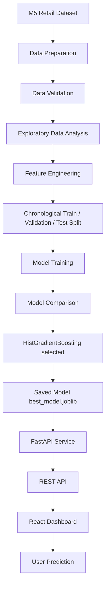

# DemandAI — Retail Demand Forecasting

DemandAI is an end-to-end machine learning system that forecasts daily product-level retail demand. It spans the full lifecycle: data preparation, leakage-safe feature engineering, chronological model comparison, a FastAPI prediction service, and a React dashboard.

## The Problem

Retailers must estimate future product demand to avoid costly failures on both sides of the inventory equation:

- **Stockouts** — lost sales and unhappy customers when demand is underestimated.
- **Overstock** — tied-up capital and waste (especially for perishable goods) when demand is overestimated.
- **Inventory holding costs** — storage, insurance, and depreciation on excess stock.
- **Inefficient replenishment** — reorder decisions made on gut feel rather than evidence.

DemandAI addresses this by learning demand patterns from historical sales and exposing per-product predictions through an API and dashboard, so replenishment decisions can be grounded in data.

## Features

- Reproducible data-preparation pipeline from the raw M5 competition files.
- Safe preprocessing that never fabricates observations (gaps are detected and reported, not silently filled).
- Leakage-safe feature engineering (lags, rolling statistics, calendar, event, and price features).
- Chronological train/validation/test splitting appropriate for time series.
- Comparison of three regression models with automatic winner selection on validation R².
- FastAPI prediction service with single and batch endpoints and Pydantic validation.
- React + Vite dashboard with live health status, single/batch prediction, and session history.

## Tech Stack

**Backend / ML:** Python, FastAPI, Pandas, NumPy, scikit-learn, XGBoost, Joblib, Pytest
**Frontend:** React, Vite, React Router, Vitest, React Testing Library
**Data:** M5 Forecasting – Accuracy (Walmart), subset: store `CA_1`, category `FOODS`, top 50 products

## Project Architecture



### Why chronological splitting (not random)?

For time-series forecasting, a random split leaks the future into the past: rows from later dates can land in the training set while earlier dates land in the test set, letting the model "peek" at outcomes it would never have at prediction time. That produces optimistic, dishonest metrics. DemandAI instead splits strictly by date — **train = oldest ~70%, validation = middle ~15%, test = newest ~15%** — so evaluation mimics the real task: fit on the past, predict the future. Split boundaries are computed on unique dates, so no calendar day appears in two splits.

## Dataset

The system uses the [M5 Forecasting – Accuracy](https://www.kaggle.com/competitions/m5-forecasting-accuracy) dataset (real Walmart daily unit sales). A reproducible script subsets it to one store (`CA_1`), one category (`FOODS`), and the 50 top-selling products, then reshapes the wide daily format into a tidy long table with columns: `date, product_id, product_name, category, sales_quantity, price, snap_day, holiday, event_name, store_id`.

The raw M5 files and all generated CSVs are **not committed** (see [Limitations](#limitations) and `.gitignore`); the preparation script regenerates them from the Kaggle download.

## ML Pipeline

1. **Preparation** — subset and reshape raw M5 files into the DemandAI schema.
2. **Preprocessing** — validate, de-duplicate, forward-fill prices using past information only, detect date gaps, and flag (never delete) demand outliers.
3. **EDA** — reusable analytics service producing trend, product, event, price, and day-of-week summaries.
4. **Feature engineering** — leakage-safe lag/rolling/calendar/event/price features.
5. **Training & comparison** — chronological split, three models, automatic selection.
6. **Serving** — the saved model bundle is loaded once by the FastAPI service.

## Feature Engineering

| Category | Examples | Notes |
|---|---|---|
| **Lag** | `lag_1`, `lag_7`, `lag_14`, `lag_28` | Past sales via `groupby(product).shift(k)` — strictly earlier rows. |
| **Rolling statistics** | `rolling_mean_7/14/28`, `rolling_std/min/max`, `rolling_median_7/28` | Computed on `sales.shift(1)` so today's value is never in the window. |
| **Expanding** | `expanding_mean` | Mean of all strictly-previous days. |
| **Calendar** | `year, month, quarter, week_of_year, day_of_month, day_of_week, day_of_year` | Deterministic functions of the date. |
| **Weekend** | `is_weekend` | 1 on Saturday/Sunday. |
| **SNAP** | `snap_day` | U.S. food-assistance disbursement day — a real demand driver for FOODS. Kept distinct from marketing promotions. |
| **Holiday / event** | `holiday`, `has_named_event` | Binary flags; the raw event identity is preserved upstream for analysis. |
| **Price** | `price_change`, `price_pct_change`, `rolling_price_mean_7`, `rolling_price_std_7` | Past-only; captures real markdowns without a fabricated discount column. |

### Data leakage prevention

Leakage is prevented at three points: (1) **splitting** is chronological, so the model never trains on dates after the ones it's evaluated on; (2) **rolling/expanding features** are computed on the target shifted by one day, so a given day's window ends at *t−1* and cannot contain the value being predicted; (3) **price repair** uses forward fill only (past information), never backward fill from the future. Warm-up rows where insufficient history exists are left as `NaN` rather than imputed. The winning model (HistGradientBoosting) ingests `NaN` natively.

## Model Comparison

Three regression models were trained on the identical chronological split. **Only validation R² was used to pick the winner; the test set was held out and never consulted during selection.**

| Model | Validation R² | Test R² |
|---|---|---|
| XGBoost (tuned) | 0.7232 | 0.6764 |
| RandomForest | 0.7251 | 0.6844 |
| **HistGradientBoosting** | **0.7294** | **0.7041** |

## Final Model

**HistGradientBoosting** was selected on validation R² and, encouragingly, also generalized best to the untouched test set.

| Metric | Test-set value |
|---|---|
| R² | 0.7041 |
| MAE | 4.9338 |
| RMSE | 7.6485 |

Interpretation: on held-out future data the model explains roughly 70% of demand variance, with predictions off by about 4.9 units on average. This is a solid, honest baseline for a single-store FOODS subset — not a state-of-the-art competition result, and not tuned to the test set.

## Backend API

FastAPI service loading the model bundle exactly once at startup. Interactive OpenAPI docs are available at `/docs` (Swagger UI) and `/redoc` when the server is running. See [API Endpoints](#api-endpoints) and [`docs/API.md`](docs/API.md).

## Frontend Dashboard

React + Vite single-page app: live API/model health (auto-refreshing every 30s), a validated single-prediction form, batch prediction via JSON or CSV upload, and session-only prediction history. The backend URL is configurable via `VITE_API_BASE_URL`.

## Project Structure

```
demandai/
├── backend/
│   ├── app/
│   │   ├── api/           # FastAPI routers + app factory
│   │   ├── schemas/       # Pydantic request/response models
│   │   └── services/      # analytics + prediction service
│   ├── ml/                # preprocessing, features, training, comparison
│   ├── scripts/           # CLI runners for each pipeline stage
│   ├── tests/             # Pytest suites
│   └── requirements.txt
├── frontend/
│   ├── src/
│   │   ├── components/     # reusable UI + feature components
│   │   ├── hooks/          # useHealth, useHistory
│   │   ├── pages/          # Dashboard, Single, Batch, History
│   │   ├── services/       # api.js (single backend seam)
│   │   └── utils/          # pure helpers
│   ├── package.json
│   └── vite.config.js
├── docs/                   # API and ML methodology docs
├── deploy/                 # deployment configuration templates
├── README.md
└── .gitignore
```

## Installation

**Prerequisites:** Python 3.11 or 3.12 (NumPy 1.26 ships no wheels for newer versions), Node.js 18+.

```bash
git clone <your-repo-url>
cd demandai
```

## Backend Setup

```bash
cd backend
python -m venv venv
# Windows:
venv\Scripts\activate
# macOS/Linux:
source venv/bin/activate
pip install -r requirements.txt
python verify_setup.py
```

> **Windows PowerShell note.** If PowerShell's execution policy blocks
> `venv\Scripts\activate` (or `npm.ps1`), you don't need to change any
> security setting. Either use the Command Prompt (`cmd.exe`) to activate,
> or skip activation entirely and call the venv's Python directly, e.g.
> `venv\Scripts\python.exe -m pip install -r requirements.txt` and
> `venv\Scripts\python.exe verify_setup.py`.

To reproduce the model from raw data, download the M5 dataset into `backend/datasets/raw/` (see `scripts/prepare_m5_subset.py`) and run the pipeline scripts in order: `prepare_m5_subset → run_preprocessing → run_feature_engineering → run_training → run_model_comparison`.

## Frontend Setup

```bash
cd frontend
npm install
cp .env.example .env    # optional: override VITE_API_BASE_URL
```

## Running Locally

Start the backend (from `backend/`, venv active):

```bash
uvicorn app.api.predict:app --reload
```

> **Windows PowerShell note.** If activation is blocked, run uvicorn
> through the venv's Python without activating:
> `venv\Scripts\python.exe -m uvicorn app.api.predict:app --reload`

Start the frontend (from `frontend/`, in a second terminal):

```bash
npm run dev
```

Open the dashboard at `http://localhost:5173`. In development, Vite proxies `/api` to `http://127.0.0.1:8000`, so no CORS configuration is needed locally.

## Running Tests

```bash
# Backend
cd backend
pytest -v

# Frontend
cd frontend
npm test

# Frontend production build
npm run build
```

## API Endpoints

| Method | Path | Purpose |
|---|---|---|
| GET | `/` | Service metadata. |
| GET | `/health` | Health + whether the model is loaded. |
| POST | `/predict` | Single prediction. |
| POST | `/predict/batch` | Batch of predictions. |

Full request/response schemas and examples: [`docs/API.md`](docs/API.md).

## Example Prediction

Request to `POST /predict`:

```json
{
  "date": "2016-03-01",
  "product_id": "FOODS_3_090",
  "price": 3.48,
  "snap_day": 1,
  "holiday": 0,
  "has_named_event": 0,
  "features": [
    { "name": "lag_1", "value": 12.0 },
    { "name": "lag_7", "value": 9.0 },
    { "name": "rolling_mean_7", "value": 10.5 }
  ]
}
```

Response:

```json
{
  "product_id": "FOODS_3_090",
  "date": "2016-03-01",
  "predicted_sales": 10.75,
  "processing_time_ms": 3.2,
  "model_type": "HistGradientBoosting"
}
```

(The `10.75` value reflects a manually verified prediction from development; exact values depend on the supplied feature inputs.)

## Model Performance

Selected model (HistGradientBoosting), evaluated on the held-out newest ~15% of dates: **R² 0.7041, MAE 4.9338, RMSE 7.6485**. The Phase-6 baseline (a single model, no comparison) scored R² 0.6931 / MAE 4.9151 / RMSE 7.8407, so the comparison stage improved R² and RMSE on the test set.

## Limitations

- Trained on **historical M5 retail data** for a single store and the FOODS category; performance on other stores, categories, or real-world businesses will differ and should be re-validated.
- Predictions depend heavily on **lag and rolling features**, which require recent sales history for the product; cold-start products (no history) are not well served.
- This is a **demand-prediction** system, **not** a real-time inventory-optimization or automatic-replenishment system.
- There is **no automated retraining pipeline**; the model is a static artifact trained on a fixed dataset.
- The dashboard's prediction history is **session-only** (not persisted).
- Being able to deploy the project does **not** imply production-scale reliability, monitoring, or SLAs.

## Future Improvements

Automated retraining; model monitoring and drift detection; experiment tracking; multi-horizon and probabilistic forecasts; richer product/store features; database-backed prediction history; authentication; Docker; CI/CD; cloud deployment; and integration with an inventory-optimization layer. All of these are **future work**, not current functionality.

## Author

**Tej Pandey**

Built as an end-to-end ML Engineering portfolio project.
