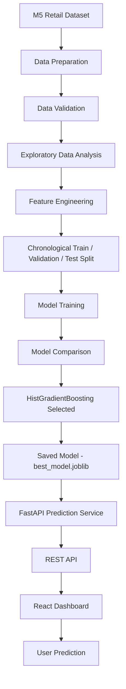

# DemandAI — Retail Demand Forecasting

DemandAI is an end-to-end machine learning system for forecasting daily product-level retail demand.

The project covers the complete ML lifecycle — from raw retail data preparation and leakage-safe feature engineering to model comparison, FastAPI-based inference, and an interactive React dashboard deployed on the web.

## Live Demo

DemandAI is deployed as a full-stack machine learning application.

- **Frontend:** React + Vite deployed on Vercel
- **Backend:** FastAPI deployed on Render
- **ML Model:** HistGradientBoosting
- **Prediction Modes:** Single prediction, Batch JSON, and CSV upload
- **Monitoring:** Live API and model health status
- **History:** Session-based prediction history

### Production Architecture

```text
User
  ↓
Vercel
React + Vite Frontend
  ↓
Render
FastAPI Prediction API
  ↓
HistGradientBoosting Model
  ↓
Predicted Product Demand
```

> **Note:** The backend currently uses Render's free instance tier. The first API request after a period of inactivity may take longer while the service starts.

---

## The Problem

Retailers must estimate future product demand accurately to avoid costly inventory problems.

Poor demand forecasting can lead to:

- **Stockouts** — lost sales and unhappy customers when demand is underestimated.
- **Overstock** — tied-up capital and waste when demand is overestimated.
- **Inventory holding costs** — unnecessary storage, insurance, and depreciation.
- **Inefficient replenishment** — inventory decisions based on intuition instead of data.

DemandAI addresses this problem by learning demand patterns from historical retail sales and exposing product-level predictions through a REST API and web dashboard.

---

## Features

- End-to-end retail demand forecasting pipeline
- Reproducible data preparation from the M5 dataset
- Safe preprocessing and validation
- Leakage-safe time-series feature engineering
- Lag and rolling demand features
- Calendar, event, SNAP, and price features
- Chronological train/validation/test splitting
- Comparison of multiple regression models
- Automatic model selection using validation R²
- Saved production model using Joblib
- FastAPI prediction service
- Single prediction API
- Batch prediction API
- Pydantic request validation
- React + Vite dashboard
- Live backend/model health monitoring
- Single-product prediction interface
- Batch prediction using JSON
- Batch prediction using CSV upload
- Session-based prediction history
- Automated backend and frontend tests
- Production deployment using Vercel + Render

---

## Tech Stack

### Machine Learning / Backend

- Python
- Pandas
- NumPy
- scikit-learn
- XGBoost
- Joblib
- FastAPI
- Pydantic
- Uvicorn
- Pytest

### Frontend

- React
- Vite
- React Router
- Vitest
- React Testing Library

### Deployment

- Vercel — frontend
- Render — FastAPI backend
- GitHub — source control and deployment integration

### Dataset

**M5 Forecasting – Accuracy**

DemandAI currently uses:

- Store: `CA_1`
- Category: `FOODS`
- Top 50 products

---

## Project Architecture



---

## Why Chronological Splitting?

Traditional random train/test splitting is inappropriate for time-series forecasting because it can allow future observations to appear in the training data while earlier observations appear in the test data.

This creates **data leakage** and produces overly optimistic model performance.

DemandAI instead uses a chronological split:

```text
Oldest dates                     Newest dates
     │                                │
     ▼                                ▼
┌──────────────┬────────────┬────────────┐
│    Train     │ Validation │    Test    │
│     ~70%     │    ~15%    │    ~15%   │
└──────────────┴────────────┴────────────┘
```

The model therefore learns from the past and is evaluated on future observations.

Split boundaries are computed using unique dates so the same calendar day cannot appear in multiple splits.

---

## Dataset

DemandAI uses the **M5 Forecasting – Accuracy** dataset containing historical Walmart retail sales.

The preparation pipeline selects:

- One store: `CA_1`
- One category: `FOODS`
- 50 top-selling products

The original wide M5 dataset is transformed into a tidy structure containing:

```text
date
product_id
product_name
category
sales_quantity
price
snap_day
holiday
event_name
store_id
```

Raw M5 files and generated datasets are not committed to the repository. They can be regenerated using the included preparation scripts.

---

## Machine Learning Pipeline

DemandAI follows six major ML stages.

### 1. Data Preparation

The raw M5 files are filtered and transformed into the DemandAI retail schema.

### 2. Data Preprocessing

The preprocessing pipeline:

- validates required columns
- detects invalid dates
- handles duplicate observations
- validates sales quantities
- repairs prices using past information only
- detects date gaps
- flags demand outliers

Missing observations are not silently converted into fake zero-sales records.

### 3. Exploratory Data Analysis

Reusable analytics components generate information about:

- demand trends
- products
- events
- prices
- day-of-week behaviour
- outliers

### 4. Feature Engineering

Time-series features are generated without using future target information.

### 5. Model Training & Comparison

Multiple regression models are trained using the same chronological split.

The winning model is selected using **validation R²**.

### 6. Model Serving

The selected model bundle is saved and loaded by FastAPI for real-time inference.

---

## Feature Engineering

| Category | Examples | Description |
|---|---|---|
| **Lag** | `lag_1`, `lag_7`, `lag_14`, `lag_28` | Historical product sales from earlier dates |
| **Rolling Statistics** | `rolling_mean_7`, `rolling_mean_14`, `rolling_mean_28` | Past-window demand statistics |
| **Rolling Variation** | rolling std/min/max/median | Captures demand volatility |
| **Expanding** | `expanding_mean` | Mean of all previous observations |
| **Calendar** | year, month, quarter, week, day | Calendar-based demand patterns |
| **Weekend** | `is_weekend` | Identifies Saturday/Sunday |
| **SNAP** | `snap_day` | Food-assistance disbursement indicator |
| **Holiday/Event** | `holiday`, `has_named_event` | Event-related demand effects |
| **Price** | `price_change`, `price_pct_change` | Price movement information |
| **Rolling Price** | rolling price mean/std | Historical price behaviour |

---

## Data Leakage Prevention

Preventing future information from leaking into training is a major design goal of DemandAI.

Leakage is prevented in several ways:

### Chronological splitting

The model trains only on dates occurring before validation and test dates.

### Shifted rolling features

Rolling and expanding target features operate on historical values only.

For example, a rolling feature for day `t` uses information ending at:

```text
t - 1
```

rather than including the target value for day `t`.

### Past-only price repair

Missing/invalid prices are forward-filled using previously observed prices.

Future prices are never copied backward.

### Warm-up observations

Rows without enough historical information remain `NaN` instead of being artificially filled.

HistGradientBoosting can handle these missing values natively.

---

## Model Comparison

Three regression approaches were evaluated using the same chronological split.

| Model | Validation R² | Test R² |
|---|---:|---:|
| XGBoost (tuned) | 0.7232 | 0.6764 |
| RandomForest | 0.7251 | 0.6844 |
| **HistGradientBoosting** | **0.7294** | **0.7041** |

Only **validation R²** was used to select the winning model.

The test set remained untouched during model selection.

---

## Final Model

The selected production model is:

### HistGradientBoosting

Final performance on the held-out test period:

| Metric | Test Value |
|---|---:|
| **R²** | **0.7041** |
| **MAE** | **4.9338** |
| **RMSE** | **7.6485** |

The model explains approximately **70% of demand variance** on the held-out future data.

Its average absolute prediction error is approximately **4.9 units**.

These results represent an honest baseline for the selected single-store FOODS subset rather than a state-of-the-art M5 competition result.

---

## Backend API

DemandAI exposes the trained model through a FastAPI service.

The model bundle is loaded once when the service starts and reused across prediction requests.

FastAPI also provides interactive API documentation:

```text
/docs
/redoc
```

---

## API Endpoints

| Method | Endpoint | Purpose |
|---|---|---|
| GET | `/` | Service information |
| GET | `/health` | API and model health |
| POST | `/predict` | Single demand prediction |
| POST | `/predict/batch` | Batch demand predictions |

Detailed API documentation is available in:

```text
docs/API.md
```

---

## Example Prediction Request

Request to:

```text
POST /predict
```

Example:

```json
{
  "date": "2016-03-01",
  "product_id": "FOODS_3_090",
  "price": 3.48,
  "snap_day": 1,
  "holiday": 0,
  "has_named_event": 0,
  "features": [
    {
      "name": "lag_1",
      "value": 12.0
    },
    {
      "name": "lag_7",
      "value": 9.0
    },
    {
      "name": "rolling_mean_7",
      "value": 10.5
    }
  ]
}
```

Example response:

```json
{
  "product_id": "FOODS_3_090",
  "date": "2016-03-01",
  "predicted_sales": 10.75,
  "processing_time_ms": 3.2,
  "model_type": "HistGradientBoosting"
}
```

Exact predictions depend on the supplied feature values.

---

## Frontend Dashboard

The DemandAI frontend is built using React and Vite.

It provides four primary sections.

### Dashboard

Displays:

- API health
- model loading status
- backend connectivity

### Single Prediction

Allows users to provide:

- date
- product ID
- price
- historical lag features
- rolling features
- SNAP/event indicators

and receive an immediate demand prediction.

### Batch Prediction

Supports multiple predictions through:

- JSON requests
- CSV file upload

Batch results are displayed in a table.

### Prediction History

Records prediction activity during the current browser session.

History includes:

- prediction time
- product/date or batch information
- predicted sales for single predictions
- success/error status

History is currently session-only and is not stored in a database.

---

## Project Structure

```text
demandai/
│
├── backend/
│   ├── app/
│   │   ├── api/             # FastAPI application and routes
│   │   ├── schemas/         # Pydantic request/response schemas
│   │   └── services/        # Prediction and analytics services
│   │
│   ├── ml/                  # ML pipeline
│   ├── models/              # Saved production model
│   ├── scripts/             # Pipeline scripts
│   ├── tests/               # Backend tests
│   └── requirements.txt
│
├── frontend/
│   ├── src/
│   │   ├── components/      # React components
│   │   ├── hooks/           # Custom React hooks
│   │   ├── pages/           # Application pages
│   │   ├── services/        # API client
│   │   └── utils/           # Utility functions
│   │
│   ├── package.json
│   └── vite.config.js
│
├── docs/                    # API and ML documentation
├── deploy/                  # Deployment configuration
├── README.md
└── .gitignore
```

---

## Installation

### Prerequisites

Install:

- Python 3.11 or 3.12
- Node.js 18+
- Git

Clone the repository:

```bash
git clone https://github.com/tejjpandeyy/DemandAI.git
cd DemandAI
```

---

## Backend Setup

Navigate to the backend:

```bash
cd backend
```

Create a virtual environment:

```bash
python -m venv venv
```

### Windows

```bash
venv\Scripts\activate
```

### macOS / Linux

```bash
source venv/bin/activate
```

Install dependencies:

```bash
pip install -r requirements.txt
```

Verify the setup:

```bash
python verify_setup.py
```

---

## Running the Backend

From the `backend` directory:

```bash
uvicorn app.api.predict:app --reload
```

The API will normally run at:

```text
http://127.0.0.1:8000
```

Health endpoint:

```text
http://127.0.0.1:8000/health
```

Swagger documentation:

```text
http://127.0.0.1:8000/docs
```

---

## Frontend Setup

Open another terminal:

```bash
cd frontend
npm install
```

Start the development server:

```bash
npm run dev
```

The frontend normally runs at:

```text
http://localhost:5173
```

During local development, Vite proxies API requests to the local FastAPI backend.

For production, the backend URL is configured through:

```text
VITE_API_BASE_URL
```

---

## Running Tests

DemandAI contains automated tests for both the ML/backend pipeline and frontend application.

### Backend

```bash
cd backend
pytest -v
```

Current verified result:

```text
102 passed
```

### Frontend

```bash
cd frontend
npm test
```

Current verified result:

```text
20 passed
```

### Production Frontend Build

```bash
npm run build
```

The current production build completes successfully.

---

## Deployment

DemandAI uses separate frontend and backend deployments.

### Frontend — Vercel

The React/Vite application is deployed through Vercel and connected to the GitHub repository.

Pushes to the production branch can trigger new frontend deployments.

### Backend — Render

The FastAPI backend is deployed as a Render Web Service.

Render configuration:

```text
Root Directory:
backend

Build Command:
pip install -r requirements.txt

Start Command:
uvicorn app.api.predict:app --host 0.0.0.0 --port $PORT
```

### Frontend → Backend Connection

The deployed frontend uses:

```text
VITE_API_BASE_URL
```

to communicate with the public FastAPI service.

Production request flow:

```text
Browser
   ↓
Vercel Frontend
   ↓
FastAPI on Render
   ↓
HistGradientBoosting
   ↓
Prediction Response
   ↓
React Dashboard
```

---

## Testing Coverage

Backend tests cover areas including:

- data preprocessing
- data validation
- feature engineering
- leakage prevention
- chronological splitting
- model training
- model comparison
- model artifact creation
- API validation
- single prediction
- batch prediction
- deterministic predictions
- model loading behaviour

Frontend tests cover:

- input formatting and validation
- API health state
- prediction form behaviour
- loading states
- API errors
- batch prediction
- JSON validation
- history rendering
- history clearing

Current automated test count:

```text
Backend:  102 passing
Frontend:  20 passing
----------------------
Total:    122 passing
```

---

## Limitations

DemandAI currently has several important limitations:

- The model is trained on historical M5 retail data rather than live business data.
- The current dataset subset contains one store and the FOODS category.
- Performance on other stores, categories, or real businesses requires re-validation.
- Predictions rely heavily on lag and rolling features.
- Cold-start products without sufficient historical sales are not well supported.
- The model artifact is static and there is currently no automated retraining pipeline.
- Prediction history is stored only for the browser session.
- DemandAI predicts demand but does not automatically optimize inventory or place replenishment orders.
- The current deployment should be considered a portfolio/demo deployment rather than a production system with enterprise SLAs and monitoring.

---

## Future Improvements

Potential future development includes:

- Automated model retraining
- Model monitoring
- Data and prediction drift detection
- Experiment tracking
- Multi-step demand forecasting
- Probabilistic forecasting
- Additional stores and product categories
- Richer product/store features
- Persistent prediction history
- PostgreSQL integration
- User authentication
- Docker containerization
- CI/CD pipeline
- Cloud monitoring
- Inventory optimization
- Automated replenishment recommendations

---

## Author

**Tej Pandey**

Built as an end-to-end **Machine Learning Engineering portfolio project** demonstrating:

**Data Engineering → Feature Engineering → Time-Series ML → Model Evaluation → FastAPI → React → Testing → Deployment**